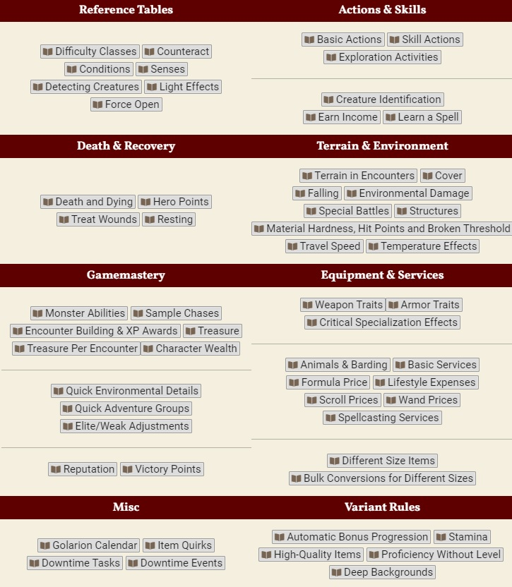

# PF2e GM Screen

A community made GM Screen to help run PF2E games in Foundry VTT.
Import !GM Screen from Compendium to use.

This module uses trademarks and/or copyrights owned by Paizo Inc., which are used under Paizo's Community Use Policy. We are expressly prohibited from charging you to use or access this content. This module is not published, endorsed, or specifically approved by Paizo Inc. For more information about Paizo's Community Use Policy, please visit paizo.com/communityuse. For more information about Paizo Inc. and Paizo products, please visit paizo.com.

## Content Usage and Licensing:

- Any Pathfinder Second Edition information used under the Paizo Inc. Community Use Policy (https://paizo.com/community/communityuse)
- Game system information and mechanics are licensed under the Open Game License (OPEN GAME LICENSE Version 1.0a).
